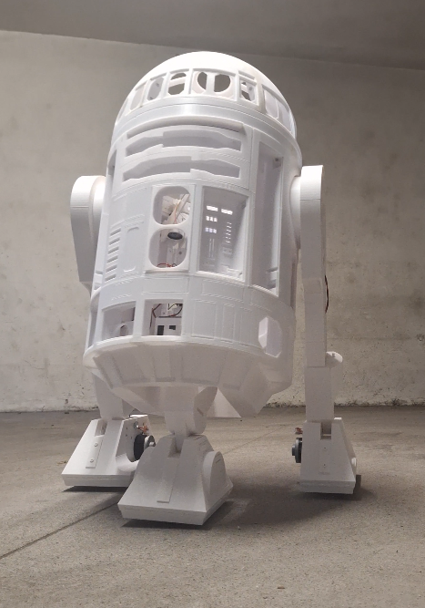
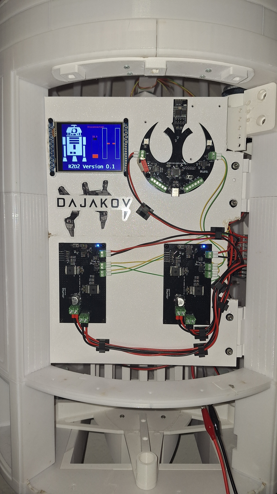
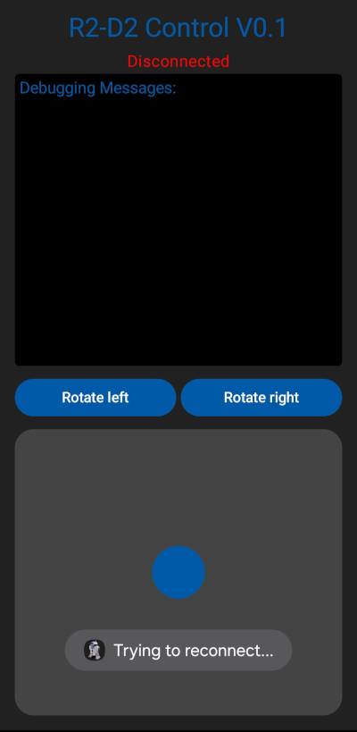
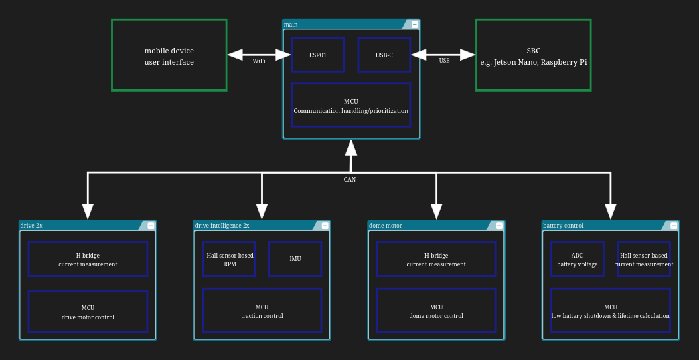

# R2D2 Robotic Control System

  
  

This repository contains all source files for a robotic control system designed to control a life-sized R2D2 robot. The 3D models were created by  [Michael Baddeley](https://www.patreon.com/mrbaddeley).

I initiated this project due to the need for a smart and reliable way to control R2D2 via an Android app. I began developing a simple proof-of-concept app in Android Studio, featuring:

- A joystick for velocity control
- Two buttons to rotate the dome
- A text field to display debugging messages

The communication between the hardware and the app occurs via a WebSocket connection to an ESP01.

# Hardware

I designed multiple subsystems, each with its own PCB. The brain of every subsystem is a STM32 microcontroller, responsible for fulfilling unique tasks. These PCBs communicate with each other via CAN-bus.

The main PCB serves as the translator for incoming data from the Android app, converting it into low-level commands for the subsystems which control the actual hardware. 

# Firmware

The STM32 microcontrollers were programmed using STM32CubeIDE. This repository contains the entire CubeIDE project directory for each subsystem.
Each PCB features a 2.54mm male pin header, allowing for easy flashing and debugging via SWD (Serial Wire Debug).

# Development

Hardware:
- [x] Test main PCB
- [x] Test drive PCB
- [ ] Test dome-motor PCB
- [ ] Test drive-intelligence PCB
- [ ] Test battery-control PCB

Firmware:
- [x] Velocity control 
- [x] Shut down motors on connection loss to Android App
- [ ] Increase CAN frequency

Android App:
- [x] Joystick
- [x] Buttons for dome rotation
- [ ] Add status display (battery state, error indicator)
